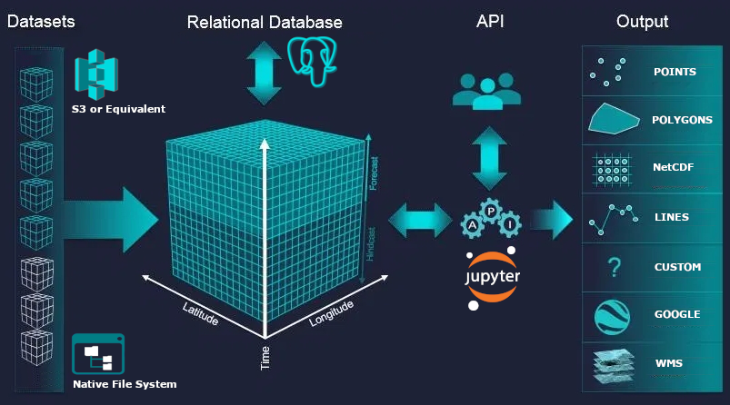
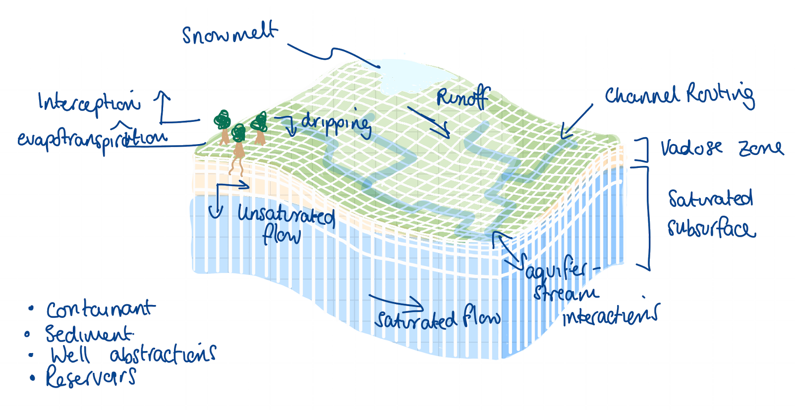

---
# POSTER ESSENTIALS
title: "Quantifying water security using hyperresolution hydrological modelling on top of an Open Data Cube (ODC)"
poster_height: "32in"
poster_width: "46in"
font_family: 'Rasa'
author:
  - name: '**Luis Felipe Patino Velasquez**'
    affil: 1
    main: true
    orcid: '0000-0003-2140-308X'
    twitter: felpave
    email: l.f.patino-velasquez2@ncl.ac.uk
  - name: '**Dr. Elizabeth Lewis**'
    affil: 1
  - name: '**Prof. John Mills**'
    affil: 1
affiliation:
  - num: 1
    address: School of Civil Engineering and Geosciences, Newcastle University, Newcastle upon Tyne, UK

#COLOUR SCHEME
primary_colour: '#000d21'
secondary_colour: '#829cab'
accent_colour: "#cc0000"

# OTHER CUSTOMIZATION
# Main Section
main_width: 0.5
main_fontfamily: "Special Elite"
main_textcol: "#FFFFFF90"
main_textsize: "170px"
main_picwidth: "100%"
main_findings: " Advancement in <font color='#ffbc00'>hydrological sciences as a data-intensive science</font> needs to explore effective approaches for the use and analysis of the petabytes of existent <font color='#ffbc00'>Eath Observation data</font>  <br><br><br><br>"
logoright_name: ""
# Body Section
body_bgcol: "#ffffff"
body_textsize: "43px"
reference_textsize: "30px"
body_textcol: "#000000"
title_textsize: "80pt"
author_textsize: "1.17em"
authorextra_textsize: "35px"
affiliation_textsize: "25px"
affiliation_textcol: '#00000080'
caption_fontsize: "20pt"
column_padding: "10mm"

bibliography: reference.bib
#--Standard Options--#
output: 
  posterdown::posterdown_betterland:
    self_contained: false
    pandoc_args: --mathjax
    highlight: espresso
    number_sections: true
---

# CONTEXT
Given the current and forecast pressures over regional and global water systems as result of population grow and human activities, water security has been recognised as one of the most significant challenges of the 21st century (@srinivasan2017dynamic). As a result, rigorous quantification of the impacts of climate change on water security have a key role informing water management and policy, and to support the progress in the implementation of the Sustainable Development Goals (SDGs) (@eekhout2018increased). 

# THE RESEARCH

This research will be at the junction of three areas: hydrological physical
modelling, satellite Earth observation data and cloud computing technology. During the past
two decades the development of hydrological predictions at spatial resolution on the order of 1
km or less has been recognised as a grand challenge in hydrology. Now that the advances in
satellite and sensor technology coupled with the development of cloud computing have enable
the advancement of hydrology as a data-intensive science, there is a considerable impetus and
interest in future research and approaches in the use of these emerging technologies to develop
new insights that contribute to fundamental aspects of the hydrological sciences.

# AIM

To evaluate water security at a regional scale as part of the collaborative laboratories (collaboratories) that form part of the Water Security & Sustainable Development Hub by implementing a hyperresolution hydrological modelling approach to quantify water scarcity and vulnerability.


# THE KNOW HOW

## Computational Framework

### Open Data Cube (ODC){-}

```{r echo=FALSE, fig.cap="ODC storing, sharing and publishing of the data architecture (image modified from https://www.cursosteledeteccion.com/la-iniciativa-global-open-data-cube/ accessed 2022-05-03", out.width = '100%'}

```


## Water Security Assessment

### PBSD - SHETRAN{-}
Simulation of hydrological processes related to blue and green
water cycles such as rainfall interception by vegetation, evaporation and transpiration, variably
saturated subsurface flow, and river/aquifer interactions.
```{r echo=FALSE, fig.cap="Conceptualisation of catchment hydrology in SHETRAN (image designed by Dr. E. Lewis)", out.width = '100%'}

```

### Water security analysis{-}
The impact of climate change on water security will consider the distribution of green water (e.g. soil moisture as result of infiltration); and blue water (e.g. waterflows through the land surface) storage. <br>
```{r echo=FALSE, out.width = '100%'}

```

# References